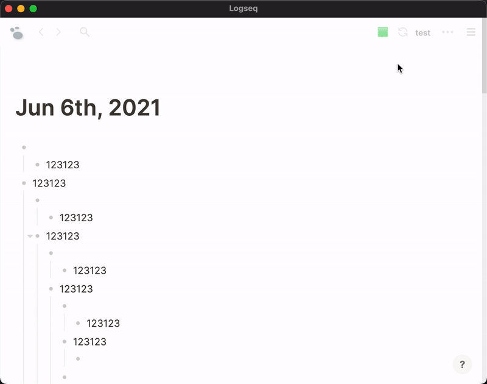

# Logseq Heatmap Plugin

This plugin will render a GitHub/Flomo style heatmap based on daily block counts or page properties on daily journal pages. By default, it shows daily block counts, i.e. how many journal blocks are created that day.

Once Logseq provides an option to denote all blocks with timestamps, we may
be able to calculate a more accurate block numbers.

## Features

1. Default view shows daily block count heatmap



2. Configurable to display heatmaps for custom page properties to track habits


3. Supports property of both inline and YAML-style (defined in the first block of a page) formats

## How to use?

Firstly, turn on Logseq developer mode

### Option 1: directly install via Marketplace

### Option 2: manually load

- [download the prebuilt package here](https://github.com/pengx17/logseq-plugin-heatmap/releases)
- unzip the zip file and load from Logseq plugins page

## Demo


## Configuration

The plugin can be configured in the plugin settings:


1. **Journal Page Properties**: Enter comma-separated properties to display as heatmaps (e.g., `workinghour,exercise,wateramount`). Set to `blockcount` by default.
2. **Displayed Properties**: Enter comma-separated display names for the properties in the same order, eg. `Working Hours,Exercise,Water Amount`. Set to `Daily Blocks` by default.

### Custom Property Format

Custom Properties should be defined following the logseq property format: `propertyname:: value`

or, defined in the first block of a page using YAML format, e.g.:

```
---
excercisehour: 2.5
---
```